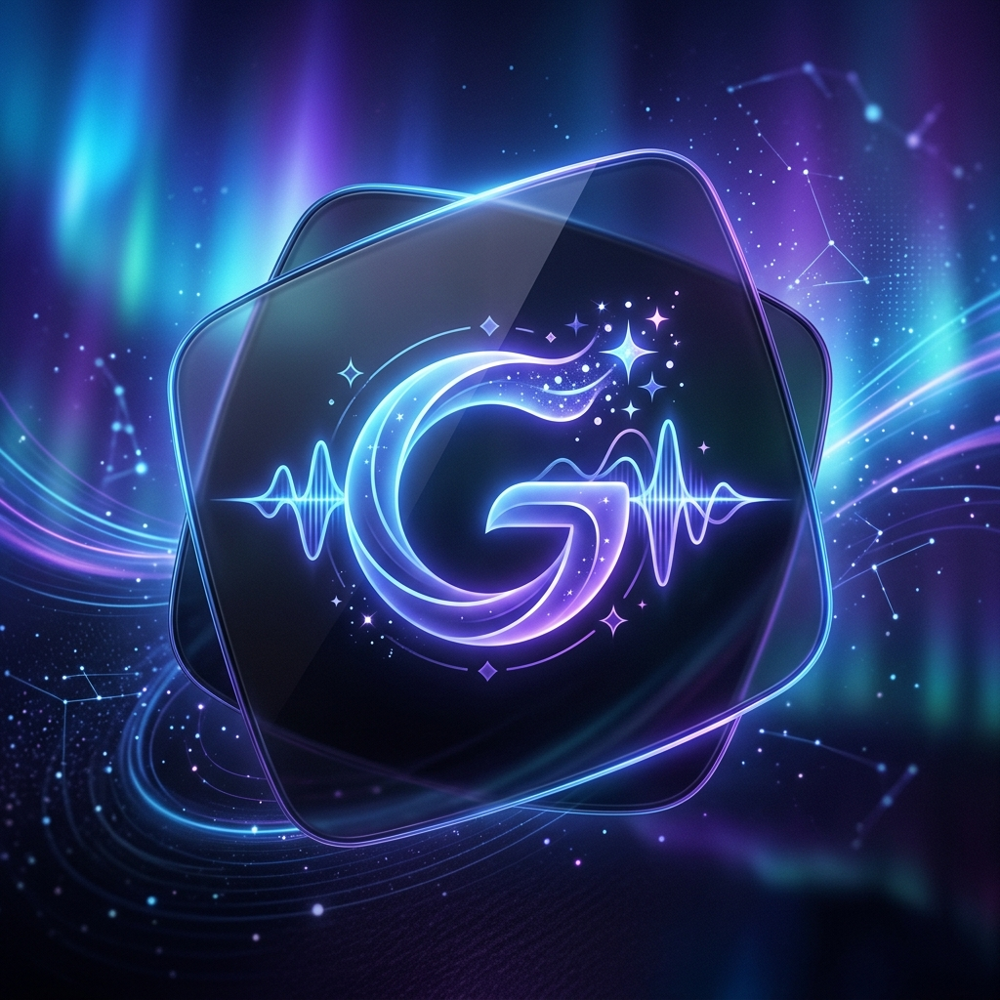
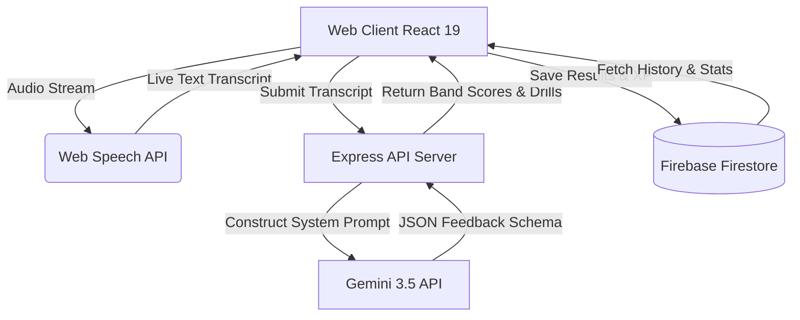

# 🎙️ Baddie Buddy: AI-Powered IELTS Speaking Coach

Baddie Buddy is an elite, immersive, full-stack IELTS Speaking preparation platform. Built with a premium, slate-zinc-indigo "digital universe" aesthetic, Baddie Buddy utilizes real-time browser-based voice transcription, advanced auditory logging, and the **Google Gemini 3.5 API** to simulate a high-fidelity IELTS speaking exam.

The system features a multi-agent AI pipeline that acts as an **Examiner, Analyst, and Pedagogical Coach**, providing students with instant IELTS Band scores (1.0 - 9.0), detailed grammatical corrections, action plans, and pinpointed pronunciation drills.

---

## 📸 Tech Stack Showcase

To keep the platform's visual identity premium and cohesive, our tech stack is represented by these custom glassmorphic cards:

| 🧠 Voice AI & Evaluation Core | 🌐 Premium Frontend Engine | 🗄️ Backend & Cloud Database |
| :---: | :---: | :---: |
|  |  |  |
| **Gemini 3.5 & Fallback Engine**<br>Dual-model architecture for evaluation & PDF structure extraction. | **React 19 + Vite + Tailwind**<br>Fluid animations via Framer Motion & performance metrics via Recharts. | **Firebase Auth/Firestore + Express**<br>Persistent user stats, gamified streaks, and Express API server. |

---

## 🚀 Key Functional Modules

### 1. 🎤 Real-Time Continuous Speech Ingestion
* **Web Speech API Integration**: Captures voice output continuously. Implements automatic restart routines to bypass browser-specific recording limits and handle unexpected dropouts.
* **Network & Connection Resilience**: Features an exponential backoff mechanism for API retries to safeguard transcriptions during network instability.
* **Smart Silence & Auditory Alerting**: Detects quiet segments in the speech path and triggers instant, supportive toasts guiding the user to speak closer to their microphone.
* **Filler Word Tracking**: Automatically analyzes transcripts in real-time to compute counts for common speech filler words like *"um"*, *"uh"*, *"like"*, and *"you know"*.

### 2. 🤖 Multi-Agent AI Assessment Pipeline
When a student ends a test, their transcript is routed to an express endpoint which coordinates the Gemini 3.5 evaluation:
* **Examiner Agent**: Evaluates structural answers according to the 4 core pillars of the official IELTS Rubric (Fluency & Coherence, Lexical Resource, Grammatical Range & Accuracy, Pronunciation).
* **Analyst Agent**: Identifies specific phoneme issues (e.g., dental fricatives, consonant clusters, vowel elongation), pulls exact grammatical mistakes from the transcript, and suggests corrected alternatives.
* **Pedagogical Coach**: Formulates a customized 3-part daily action plan and provides friendly, supportive, personalized audio feedback.
* **High-Demand Fallback**: Automatically redirects requests from `gemini-3.5-flash` to `gemini-3.1-flash-lite` if the primary service experiences rate limits or high-traffic latency.

### 3. 🗺️ Adaptive Learning Paths & Diagnostics
* **Rubric Weakness Tracking**: The dashboard aggregates past speaking sessions and highlights the user's lowest-performing rubric area.
* **Tailored Playlist Generator**: Based on the diagnosed weakness, the app automatically selects a 3-part playlist of practice questions (Part 1 general questions, Part 2 cue cards, and Part 3 follow-up discussions) to targetedly improve that category.

### 4. 📄 PDF Materials Ingestion (Admin)
* **Intelligent Document Ingestion**: Admins can paste raw text excerpts from official IELTS Speaking Guesswork PDFs.
* **Gemini Extraction Schema**: The Gemini API processes the document structure, separates questions into specific speaking parts, auto-assigns tags, and formats the output into clean, typed JSON objects for the question bank.

### 5. 🏆 Gamified Progression
* **XP & Streak engine**: Daily streaks are tracked and recorded in Firestore. Completing sessions awards XP points and tracks user engagement.
* **Achievement Badges**: Unlocks milestones such as "First Session", "Pacing Master", and "Band 8.0 Club" based on student performance.

---

## 🛠️ Architecture & Data Flow



---

## ⚙️ Setup & Installation

### 1. Prerequisites
Ensure you have **Node.js** (v18+) and **npm** installed on your system.

### 2. Project Configuration
1. Clone the repository and navigate to the project directory:
   ```bash
   npm install
   ```
2. Setup your database configuration file. Add your Firebase Web App credentials to `firebase-applet-config.json` in the root directory:
   ```json
   {
     "apiKey": "YOUR_FIREBASE_API_KEY",
     "authDomain": "YOUR_PROJECT_ID.firebaseapp.com",
     "projectId": "YOUR_PROJECT_ID",
     "storageBucket": "YOUR_PROJECT_ID.appspot.com",
     "messagingSenderId": "YOUR_MESSAGING_SENDER_ID",
     "appId": "YOUR_APP_ID",
     "firestoreDatabaseId": "(default)"
   }
   ```
3. Set your environment variables in `.env.local` or `.env` in the root directory (based on `.env.example`):
   ```env
   GEMINI_API_KEY="your-google-gemini-api-key"
   APP_URL="http://localhost:3000"
   ```

### 3. Development Command
Start the Vite development bundler and the Express server concurrently:
```bash
npm run dev
```
Open [http://localhost:3000](http://localhost:3000) in your browser.

### 4. Build and Production Run
Compile client-side assets and bundle the server:
```bash
# Build Vite production files and bundle server.ts with esbuild
npm run build

# Start the compiled production app
npm run start
```

---

## 📊 Diagnostic Utilities

Baddie Buddy features a **System Diagnostics Console Drawer** located inside the Speaking Session workspace:
* **Audio Capture Input Diagnostics**: Monitor the instant state changes of the browser recognition loop (listening, processing, silence, or idle).
* **Detailed Error Tracking**: View permission alerts, network interruptions, and recovery details.
* **History Logs**: Easily scroll through previous speech recognition sessions and debugging events.

---
Developed by Gayatri @2026 - Ahemdabad Gujarat

